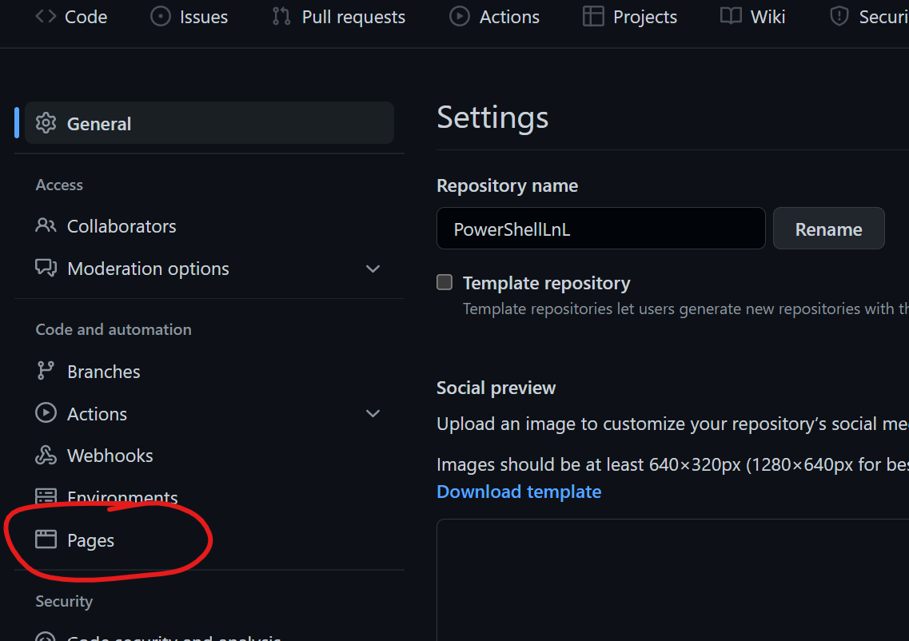
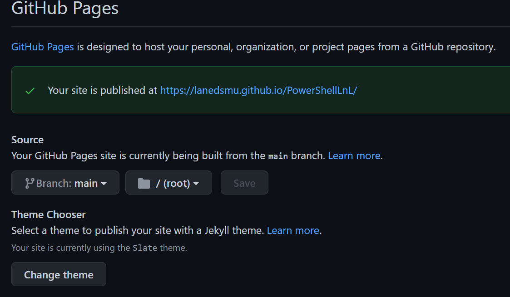
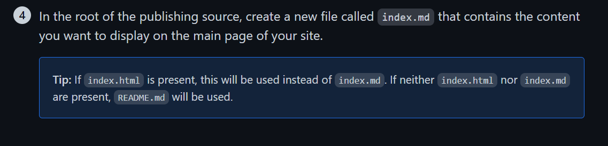

# Bonus: Github Pages

Github's markdown rendering is quite good, though sometimes you want to display text in narrower bands or with different themes, to improve readability.  Enter Github pages.

To enable pages on your repository, click on the settings icon for your repository and select the pages tab on the left, as below.

From here, choose the branch you want to use to store your documentation (you can have a branch that's dedicated to docs, for instance).  For code and script documentation, I think it's easiest just to use the main branch and leverage existing readme.md and other files that ought to exist, anyway.

Note that you don't need special html files or to use special file names in setting this up: pages pick up readme.md (default readme file name) files automatically.

